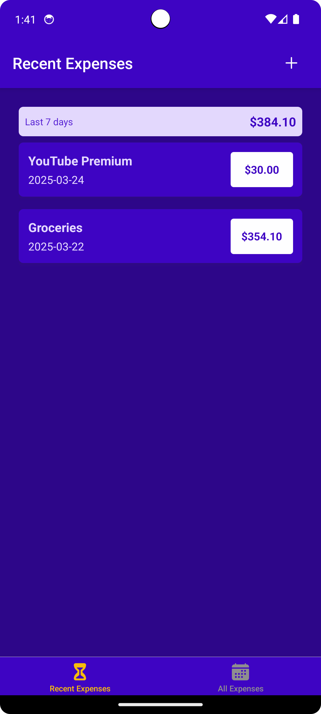
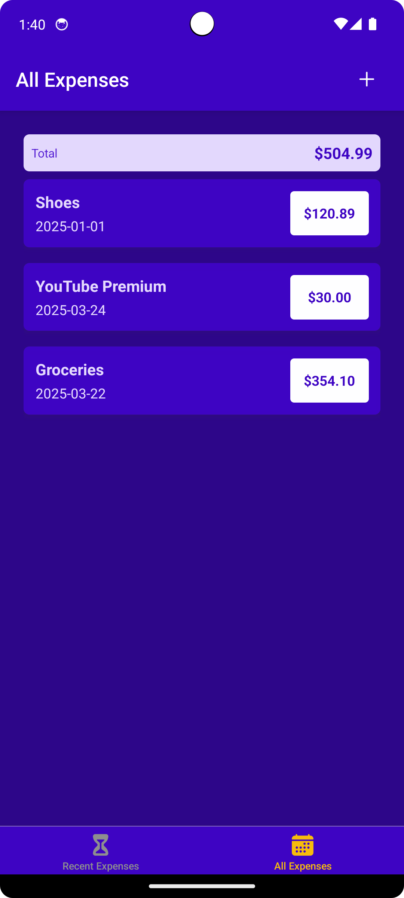
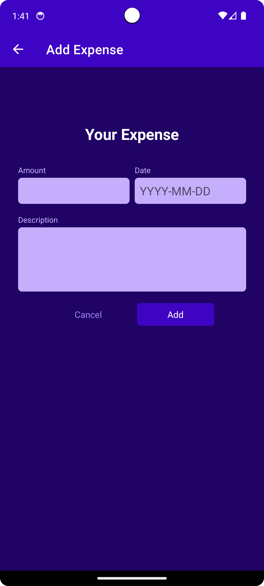
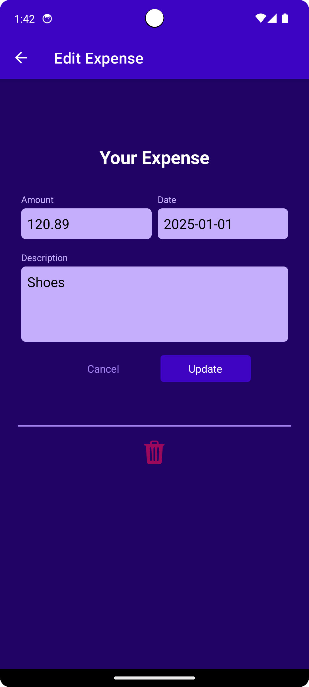

# ExpensesApp 💰

[](LICENSE)
[](https://reactnative.dev/)
[](https://firebase.google.com/)

Aplicativo demonstrativo de gerenciamento de despesas pessoais criado para explorar a integração entre:  
✅ **Sistemas de navegação** (Stack e Tab Navigation)  
✅ **Gerenciamento de estado** (Context API)  
✅ **Banco de dados em tempo real** (Firebase Firestore)

<p align="center">
  
    
</p>
<p align="center">
  
    
</p>

## ✨ Funcionalidades

- **Sistemas de navegação**:
  - Stack Navigation (fluxo principal)
  - Bottom Tab Navigation (navegação por abas)
  
- **Gerenciamento financeiro**:
  - Registro de despesas com data e valor
  - Visualização por períodos

- **Tecnologias avançadas**:
  - Integração com Firebase Firestore
  - Autenticação de usuários
  - Context API para estado global

## 🛠 Tecnologias Utilizadas

- React Native
- React Navigation
  - @react-navigation/native
  - @react-navigation/native-stack
  - @react-navigation/bottom-tabs
- Firebase
  - Firestore (banco de dados)
- Context API
- Axios

## 🔐 Variáveis de Ambiente

Crie um arquivo `.env` na raiz do projeto:

```env
BACKEND_URL=sua_url_do_firebase_aqui
```

## 🚀 Como Executar

1. Clone o repositório:

```bash
git clone https://github.com/pedester321/RNexpenseApp
cd expensesApp
```

2. Instale as dependências:

```bash
npm install
```

3. Inicie o aplicativo:

```bash
npm start
```

Ou, se estiver usando Expo:

```bash
expo start
```

4. Escaneie o QR Code com o aplicativo Expo Go no celular ou use um emulador.

## 📝 Licença

Este projeto está licenciado sob a licença MIT.

---

Desenvolvido por Pedro Castro como parte do curso **React Native - The Practical Guide** na Udemy.
